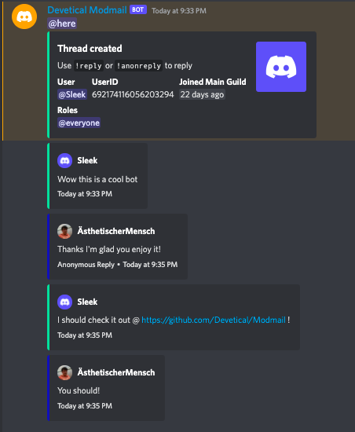

# Modmail

This is a modmail bot written in Discord.js which features both non-anonymous and anonymous replies, snippets, logviewer functionalities (coming soon), **plugin support** and more!

 

### Installation

To install modmail and get it running on your system, it's as simple as 1, 2, 3.
1) Clone this repository ``git clone https://github.com/Aesth3tical/modmail``
2) Rename ``.env.example`` to ``.env`` and fill out the required parameters
3) Run ``npm run start`` to bring the bot online

### Docs
- 🤖 [Additional Configuration](./docs/additional_configuration.md)
- 🛠️ [Plugins/Plugin Development](./docs/plugins.md)
- 💻 [Command List](./docs/commands.md)

### View the [Roadmap](./docs/roadmap.md) to stay up to date on the latest development updates!